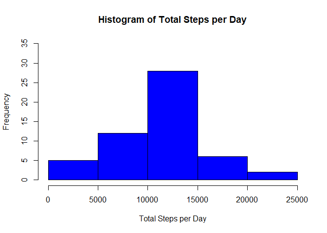
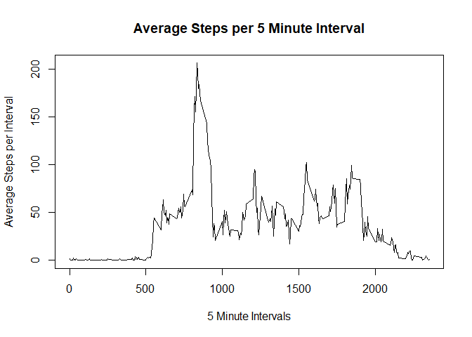
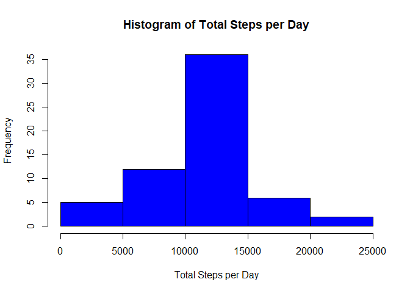
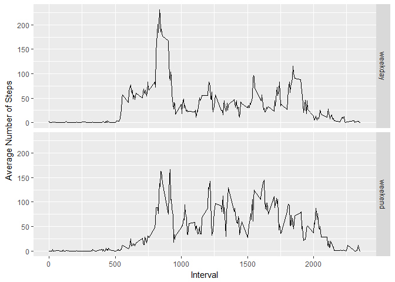

## Loading and preprocessing the data


```r
# read in the zipped file:

data <- read.csv(unz("./activity.zip","activity.csv"), 
                 header = TRUE,
                 colClasses = c("numeric", "Date","numeric"))

# convert file to data.table
library(data.table)
data <- as.data.table(data)
```

## What is mean total number of steps taken per day?

This code calculates the total number of steps taken per day:

```r
steps_per_day<- data[,.(step_sum = sum(steps)),by=.(date)] 
```

Here is a histogram of the total steps per day:

```r
hist(steps_per_day$step_sum, 
     xlab = "Total Steps per Day", 
     main = "Histogram of Total Steps per Day",
     col = "blue",
     ylim = c(0,35))
```

<!-- -->

Here are the median and mean of the total steps per day:

```r
summary(steps_per_day$step_sum)[c(3:4)]
```

```
##   Median     Mean 
## 10765.00 10766.19
```

## What is the average daily activity pattern?

Here is a time series plot that shows the average daily activity per time interval:

```r
steps_per_int <- data[,.(step_mean = mean(steps, na.rm = TRUE)),by=.(interval)]

with(steps_per_int, plot(interval, step_mean, xlab = "5 Minute Intervals", ylab = "Average Steps per Interval",main = "Average Steps per 5 Minute Interval",type = "l"))
```

<!-- -->

Here is the data for the max value shown in the plot above:

```r
subset(steps_per_int, step_mean == max(step_mean))  # returns all rows with max value
```

```
##    interval step_mean
## 1:      835  206.1698
```

## Imputing missing values

Here is the calculation and total number of missing values in the dataset. While it doesn't show it here, they were all in the "steps" column.


```r
sum(is.na(data$steps))
```

```
## [1] 2304
```

This means that about 13% of the values were missing. The missing values were imputed using the average steps per time interval, as calculated in part 2 above (average daily activity pattern). A new data set that has the missing values imputed was created with the code below.


```r
data_wo_NA<-data[,steps := replace(steps,is.na(steps),mean(steps, na.rm=TRUE)),by=.(interval)]
```

A histogram of the total steps per day, including the imputed values is shown below.

```r
steps_per_day_wo_NA<- data_wo_NA[,.(step_sum = sum(steps)),by=.(date)] 

hist(steps_per_day_wo_NA$step_sum, 
     xlab = "Total Steps per Day", 
     main = "Histogram of Total Steps per Day",
     col = "blue")
```

<!-- -->

The median and mean of the total steps per day, including the imputed vales is calculated and shown below.

```r
summary(steps_per_day_wo_NA$step_sum)[c(3:4)]
```

```
##   Median     Mean 
## 10766.19 10766.19
```

Imputing the missing values with the chosen method resulted in an mean equivalent to the calculation without the missing values, and shifted the median slightly to match the mean. Imputing the missing values using this method did not appear to change the end results very much, using the metrics given.

## Are there differences in activity patterns between weekdays and weekends?

The code below creates a new factor variable to indicate which days were weekedays and which were weekends.

```r
data_wo_NA_wd<- data_wo_NA[,day_type:=as.factor(ifelse(weekdays(date) %like% "Saturday"|weekdays(date) %like% "Sunday","weekend","weekday"))]
```

The code below calculates the average number of steps taken per weekday and per weekend-day, and creates a time series panel plot for comparison.

```r
steps_per_int_wd <- data_wo_NA_wd[,.(step_mean = mean(steps, na.rm = TRUE)),by=.(interval,day_type)]

library(ggplot2)
qplot(interval, step_mean, data = steps_per_int_wd, facets = day_type~., geom = "line",xlab = "Interval", ylab = "Average Number of Steps")
```

<!-- -->

It appears that there is greater variability between time intervals during a weekday than on a weekend, with more steps occurring in the lower time intervals.

## Thanks for taking the time to review my work!
